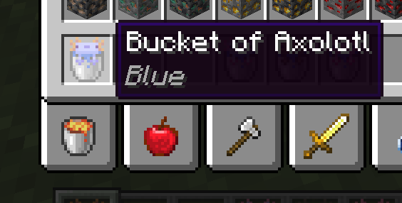

# AxolotlViewer for Fabric 

AxolotlViewer makes it easier to see what type of axolotl is in your inventory.
It adds the colour of the axolotl to the bucket's tooltip, and also changes the texture of the bucket.

## Download

Get the latest download from the [releases page](https://github.com/cbyrneee/AxolotlViewer/releases).

## Discord

## Notes 
To modify the coloured bucket texture, you need to change ``assets/axolotlviewer/textures/item/axolotl_bucket_[x].png``

``[x]`` being one of the following:
- blue
- cyan
- gold
- wild

Check the [resources](https://github.com/cbyrneee/AxolotlViewer/tree/main/src/main/resources) directory to see how it is layed out.

## License

AxolotlViewer uses the [MIT](https://choosealicense.com/licenses/mit/) license
